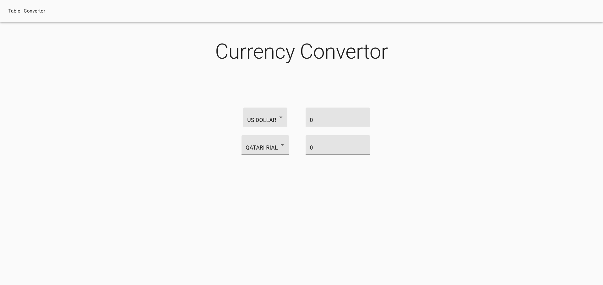
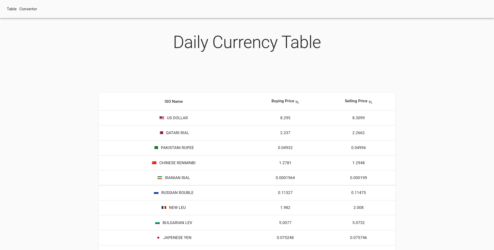

# What is this?

An internship project.

A frontend for Currency Exchange Rates parsed [from TCMB](https://www.tcmb.gov.tr/kurlar/today.xml).

Exchange rates are downloaded, parsed and saved in database with a [daemon integrated with systemd](https://github.com/eugercek/Currency-Worker).

Afterwards [a REST server](https://github.com/eugercek/Currency-REST-API) reads and serves the databse.

At the last step this program is used to display the exchange rates.

# How to run

## Without backend

Run fake rest api

```sh
npx json-server --watch ./src/fakeDB.json --port 3001
```

Change fetch [From app.js](src/App.js) to

```javascript
fetch("http://localhost:3001/currencies");
// fetch("http://localhost:5000/today/list")
```

## With backend

Use the instructions from:

- https://github.com/eugercek/Currency-Worker
- https://github.com/eugercek/Currency-REST-API

# How it Looks

<p align="center">
    
    <br>
    
</p>
